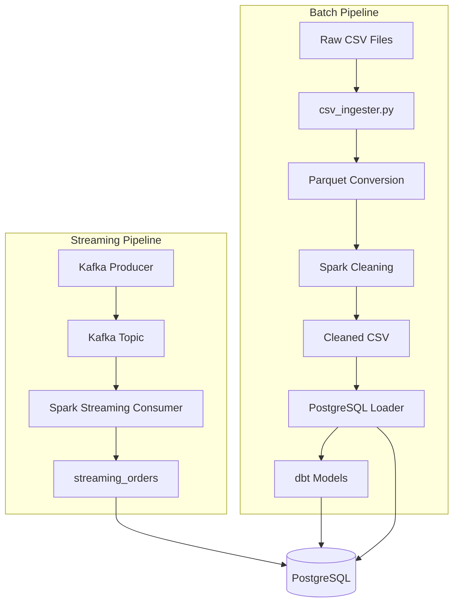

# Batch + Streaming Retail ELT Platform

A Docker-based data engineering platform built around the Olist Brazilian E-commerce dataset. The project demonstrates end-to-end batch ELT orchestration using Airflow, Spark, PostgreSQL, and dbt, alongside a Kafka-based streaming ingestion pipeline into the same warehouse.

The repository focuses on practical data engineering workflows including orchestration, distributed processing, streaming ingestion, warehouse loading, incremental transformations, and containerized infrastructure management.

---

# Project Status

This project is designed as a portfolio-oriented local ELT/data engineering platform demonstrating:

* Batch orchestration with Apache Airflow
* Distributed batch processing with PySpark
* Kafka-based event streaming
* PostgreSQL warehouse loading
* dbt transformations and testing
* Dockerized infrastructure orchestration
* Re-runnable ETL pipelines
* Structured streaming with Spark

The platform is intended for local development, experimentation, and portfolio demonstration rather than production deployment.

---

# Architecture



---

# Tech Stack

| Layer            | Technology                                    |
| ---------------- | --------------------------------------------- |
| Orchestration    | Apache Airflow 2.9.3                          |
| Batch Processing | PySpark 3.5.1                                 |
| Streaming        | Apache Kafka 7.5 + Spark Structured Streaming |
| Data Warehouse   | PostgreSQL 15                                 |
| Transformations  | dbt-core 1.7.19 + dbt-postgres                |
| Data Ingestion   | pandas                                        |
| Visualization    | Metabase                                      |
| Infrastructure   | Docker Compose                                |

---

# Repository Structure

```text
batch-streaming-retail-elt-platform/
│
├── airflow/
│   └── dags/
│       └── retail_pipeline_dag.py       # Airflow batch orchestration DAG
│
├── data/
│   ├── raw/                             # Olist source CSV datasets
│   ├── processed/                       # Generated Parquet and cleaned outputs (gitignored)
│   └── checkpoints/                     # Spark streaming checkpoints (gitignored)
│
├── dbt/
│   ├── profiles.yml.example             # Example dbt profile configuration
│   │
│   └── retail_transformations/
│       ├── dbt_project.yml              # dbt project configuration
│       │
│       └── models/
│           ├── staging/
│           │   ├── stg_orders.sql
│           │   ├── stg_customers.sql
│           │   └── schema.yml
│           │
│           └── incremental_orders.sql   # Incremental streaming model
│
├── docker/
│   └── airflow/
│       └── Dockerfile                   # Custom Airflow image with Spark + dbt
│
├── ingestion/
│   └── csv_ingester.py                  # CSV → Parquet ingestion pipeline
│
├── kafka/
│   └── producer/
│       └── orders_producer.py           # Kafka streaming event producer
│
├── postgres_loader/
│   └── load_cleaned_data.py             # Loads Spark-cleaned data into PostgreSQL
│
├── spark/
│   ├── jobs/
│   │   └── data_cleaning.py             # Batch Spark transformations
│   │
│   └── streaming/
│       └── kafka_consumer.py            # Spark Structured Streaming consumer
│
├── screenshots/                         # README screenshots and architecture visuals
│
├── docker-compose.yml                   # Infrastructure orchestration
├── requirements.txt                     # Local Python dependencies
├── .env.example                         # Environment variable template
├── .gitignore
└── README.md
```

---

# Dataset

The required Olist dataset CSV files are already included under:

```text
data/raw/
```

This allows the platform to run locally without additional download steps.

Original dataset source:

https://www.kaggle.com/datasets/olistbr/brazilian-ecommerce

---

# Infrastructure

The platform runs entirely through Docker Compose.

## Services

| Service    | Purpose             | Port         |
| ---------- | ------------------- | ------------ |
| PostgreSQL | Data warehouse      | 5433         |
| Kafka      | Streaming event bus | 9092 / 29092 |
| Zookeeper  | Kafka coordination  | 2181         |
| Airflow    | Batch orchestration | 8080         |
| Metabase   | BI dashboarding     | 3000         |

---

# Batch Pipeline

The batch pipeline is orchestrated by Airflow and scheduled to run daily.

## DAG Flow

```text
csv_ingestion
    ↓
spark_cleaning
    ↓
load_postgres
    ↓
run_dbt
    ↓
dbt_test
```

## Task Details

### 1. csv_ingestion

Script:

```text
ingestion/csv_ingester.py
```

Responsibilities:

* Reads raw Olist CSV datasets
* Converts datasets into Parquet format
* Stores outputs in `data/processed/`

---

### 2. spark_cleaning

Script:

```text
spark/jobs/data_cleaning.py
```

Responsibilities:

* Reads Parquet datasets using Spark
* Deduplicates records
* Removes invalid/null rows
* Writes cleaned CSV outputs

---

### 3. load_postgres

Script:

```text
postgres_loader/load_cleaned_data.py
```

Responsibilities:

* Loads cleaned Spark outputs into PostgreSQL
* Uses TRUNCATE + INSERT strategy
* Supports safe DAG re-runs
* Preserves dbt views during reloads

---

### 4. run_dbt

Command:

```bash
dbt run
```

Responsibilities:

* Builds staging views
* Builds incremental streaming model
* Materializes transformed warehouse objects

---

### 5. dbt_test

Command:

```bash
dbt test
```

Responsibilities:

* Executes dbt data quality tests
* Validates uniqueness and null constraints

---

# Streaming Pipeline

The streaming pipeline demonstrates real-time event ingestion into PostgreSQL.

## Flow

1. Kafka producer publishes order events
2. Kafka topic stores events
3. Spark Structured Streaming consumes events
4. PostgreSQL stores streaming records
5. dbt incremental model transforms streaming data

---

# Unified Streaming Schema

| Column       | Type    |
| ------------ | ------- |
| order_id     | integer |
| customer_id  | integer |
| order_status | string  |

---

# dbt Layer

## Models

| Model              | Type        | Source           |
| ------------------ | ----------- | ---------------- |
| stg_orders         | view        | orders           |
| stg_customers      | view        | customers        |
| incremental_orders | incremental | streaming_orders |

---

## dbt Tests

### stg_orders

* `order_id` not null
* `order_id` unique

### stg_customers

* `customer_id` not null

---

# Setup

## Prerequisites

* Docker Desktop
* Minimum 8 GB RAM recommended
* Python 3.10+ (optional for Kafka producer)

---

# Clone Repository

```bash
git clone https://github.com/premkumarrs/batch-streaming-retail-elt-platform.git

cd batch-streaming-retail-elt-platform
```

---

# Configure Environment

Create environment files:

```bash
cp .env.example .env

cp dbt/profiles.yml.example dbt/profiles.yml
```

Default PostgreSQL credentials:

```text
username: admin
password: admin123
database: retail_db
```

---

# Start Infrastructure

```bash
docker compose up -d --build
```

---

# Service Access

| Service      | URL                   | Credentials          |
| ------------ | --------------------- | -------------------- |
| Airflow      | http://localhost:8080 | admin / admin        |
| Metabase     | http://localhost:3000 | Setup on first login |
| PostgreSQL   | localhost:5433        | admin / admin123     |
| Kafka (host) | localhost:29092       | —                    |

---

# Running the Batch Pipeline

Trigger the Airflow DAG:

```bash
docker compose exec airflow airflow dags trigger retail_elt_pipeline
```

Monitor DAG execution:

```text
http://localhost:8080
```

---

# Running the Streaming Pipeline

## Terminal 1 — Start Streaming Consumer

```bash
docker compose exec airflow bash -c "cd /opt/airflow/project && python3 spark/streaming/kafka_consumer.py"
```

---

## Terminal 2 — Start Kafka Producer

```bash
pip install kafka-python

python kafka/producer/orders_producer.py
```

---

# Running dbt Manually

```bash
docker compose exec airflow bash -c "cd /opt/airflow/project/dbt/retail_transformations && dbt run --profiles-dir /opt/airflow/project/dbt && dbt test --profiles-dir /opt/airflow/project/dbt"
```

---

# Screenshots

## Airflow DAG


---

## Successful DAG Run


---

## Kafka Producer


---

## Metabase Dashboard


---

# Known Limitations

* Local development environment only
* Default credentials are hardcoded for simplicity
* Single Kafka broker deployment
* Airflow uses SequentialExecutor
* Airflow metadata stored in SQLite
* Streaming producer and consumer run manually
* Metabase requires manual PostgreSQL setup
* Batch reload fully truncates source tables

---

# Future Improvements

* Persist Airflow metadata in PostgreSQL
* Add GitHub Actions CI pipeline
* Add Docker Compose streaming profile
* Automate Metabase PostgreSQL connection
* Replace CSV round-trip with full Parquet workflow
* Add additional dbt marts and warehouse models
* Add automated monitoring and alerting

---

# License

MIT License

