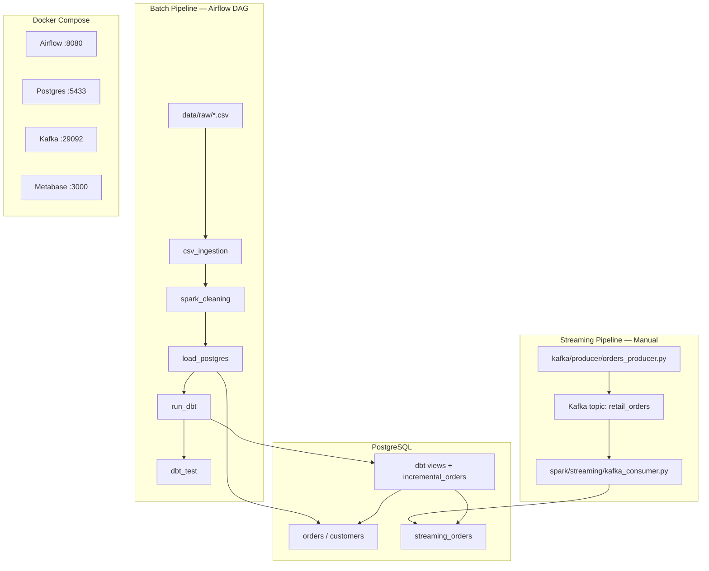

# Batch + Streaming Retail ELT Platform

A local Docker-based data platform for the [Olist Brazilian E-commerce dataset](https://www.kaggle.com/datasets/olistbr/brazilian-ecommerce). It demonstrates batch ELT orchestration with Airflow, Spark, PostgreSQL, and dbt, plus a Kafka streaming path into the same warehouse.

## Overview

This project combines two data paths:

- **Batch ELT** — CSV ingestion, Spark cleaning, PostgreSQL loading, and dbt transformations, orchestrated daily by Airflow.
- **Streaming** — Synthetic order events published to Kafka, consumed by Spark Structured Streaming, and loaded into PostgreSQL for incremental dbt modeling.

Both paths land in PostgreSQL and are transformed with dbt.

## Architecture



## Tech Stack

| Layer | Technology |
|-------|------------|
| Orchestration | Apache Airflow 2.9.3 |
| Batch processing | PySpark 3.5.1 |
| Streaming | Kafka 7.5 + Spark Structured Streaming |
| Warehouse | PostgreSQL 15 |
| Transform | dbt-core 1.7.19 + dbt-postgres |
| Ingestion | pandas |
| BI | Metabase |
| Runtime | Docker Compose |

## Batch Pipeline Flow

1. **csv_ingestion** — Converts required Olist CSVs to Parquet in `data/processed/`.
2. **spark_cleaning** — Deduplicates and null-filters orders/customers; writes cleaned CSV.
3. **load_postgres** — Loads cleaned data into `orders` and `customers` using `TRUNCATE + INSERT` (safe for re-runs; preserves dbt views).
4. **run_dbt** — Builds staging views and the streaming incremental model.
5. **dbt_test** — Runs data quality tests on staging models.

## Streaming Pipeline Flow

1. **Producer** (host) — Publishes JSON events to `retail_orders` on `localhost:29092`.
2. **Consumer** (Docker) — Spark Structured Streaming reads Kafka, parses events, and inserts into `streaming_orders`.
3. **dbt** — `incremental_orders` incrementally loads from `streaming_orders`.

**Unified streaming schema:** `order_id`, `customer_id`, `order_status`

## Repository Structure

```
├── airflow/dags/              # Airflow DAG definitions
├── data/
│   ├── raw/                   # Source CSV files (Olist dataset)
│   ├── processed/             # Generated Parquet/CSV (gitignored)
│   └── checkpoints/           # Spark streaming checkpoints (gitignored)
├── dbt/
│   ├── profiles.yml.example   # dbt connection template
│   └── retail_transformations/
│       └── models/
│           ├── staging/       # stg_orders, stg_customers
│           └── incremental_orders.sql
├── docker/
│   └── airflow/Dockerfile     # Custom Airflow image
├── ingestion/
│   └── csv_ingester.py        # CSV → Parquet
├── kafka/producer/            # Kafka test producer
├── postgres_loader/           # Spark output → PostgreSQL
├── spark/
│   ├── jobs/                  # Batch Spark jobs
│   └── streaming/             # Kafka consumer
├── docker-compose.yml
├── .env.example
└── requirements.txt           # Local Python dependencies
```

## Setup

### Prerequisites

- Docker Desktop
- 8 GB+ RAM recommended
- Python 3.10+ (optional, for host-side producer)

### 1. Clone and configure

```bash
git clone <repository-url>
cd batch-streaming-retail-elt-platform

cp .env.example .env
cp dbt/profiles.yml.example dbt/profiles.yml
```

Edit `.env` and `dbt/profiles.yml` with your local Postgres credentials (defaults: `admin` / `admin123`).

### 2. Add dataset files

Place the Olist CSV files in `data/raw/`. Required for the batch pipeline:

- `olist_orders_dataset.csv`
- `olist_customers_dataset.csv`
- `olist_products_dataset.csv`

Download from [Kaggle — Brazilian E-Commerce Public Dataset by Olist](https://www.kaggle.com/datasets/olistbr/brazilian-ecommerce).

### 3. Start the stack

```bash
docker compose up -d --build
```

### 4. Open services

| Service | URL | Default credentials |
|---------|-----|---------------------|
| Airflow | http://localhost:8080 | `admin` / `admin` |
| PostgreSQL | `localhost:5433` | `admin` / `admin123` |
| Kafka (host) | `localhost:29092` | — |
| Metabase | http://localhost:3000 | Set up on first login |

## Run Instructions

### Batch pipeline (Airflow)

Trigger the DAG from the Airflow UI or CLI:

```bash
docker compose exec airflow airflow dags trigger retail_elt_pipeline
```

Monitor progress at http://localhost:8080.

**DAG task order:**

```
csv_ingestion → spark_cleaning → load_postgres → run_dbt → dbt_test
```

The pipeline is re-runnable: `load_postgres` truncates and reloads source tables without dropping them, so dbt views remain intact.

### Streaming pipeline

**Terminal 1 — start the consumer (inside Docker network):**

```bash
docker compose exec airflow bash -c "cd /opt/airflow/project && python3 spark/streaming/kafka_consumer.py"
```

**Terminal 2 — start the producer (from host):**

```bash
pip install kafka-python
python kafka/producer/orders_producer.py
```

**Optional — refresh the streaming dbt model:**

```bash
docker compose exec airflow bash -c "cd /opt/airflow/project/dbt/retail_transformations && dbt run --select incremental_orders --profiles-dir /opt/airflow/project/dbt"
```

### dbt (manual)

```bash
docker compose exec airflow bash -c "cd /opt/airflow/project/dbt/retail_transformations && dbt run --profiles-dir /opt/airflow/project/dbt && dbt test --profiles-dir /opt/airflow/project/dbt"
```

## Airflow DAG

| Task | Script | Purpose |
|------|--------|---------|
| `csv_ingestion` | `ingestion/csv_ingester.py` | CSV → Parquet |
| `spark_cleaning` | `spark/jobs/data_cleaning.py` | Dedupe and clean |
| `load_postgres` | `postgres_loader/load_cleaned_data.py` | Load to PostgreSQL |
| `run_dbt` | `dbt run` | Build models |
| `dbt_test` | `dbt test` | Run tests |

- **Schedule:** `@daily`
- **Executor:** SequentialExecutor (local dev)
- **Retries:** 2 with 1-minute delay

## dbt Layer

| Model | Type | Source |
|-------|------|--------|
| `stg_orders` | view | `orders` |
| `stg_customers` | view | `customers` |
| `incremental_orders` | incremental | `streaming_orders` |

**Tests:**
- `stg_orders.order_id` — not null, unique
- `stg_customers.customer_id` — not null

## Screenshots

Add screenshots to the `screenshots/` folder (gitignored) and reference them here:

- Airflow DAG graph
- Successful DAG run
- dbt test results
- Metabase dashboard
- Kafka consumer output

Example:

```markdown

```

## Known Limitations

- **Local dev only** — default credentials, no TLS, single Kafka broker.
- **SequentialExecutor** — one task at a time; fine for this linear DAG.
- **Airflow metadata** — stored in SQLite inside the container; not persisted across rebuilds.
- **Streaming** — producer runs on host, consumer in Docker; not orchestrated by Airflow.
- **Metabase** — requires manual Postgres connection setup on first login (`postgres:5432` from inside Docker, or `localhost:5433` from host).
- **Batch reload** — `orders` and `customers` are fully truncated and reloaded each run (no history).

## Future Improvements

- Persist Airflow metadata to PostgreSQL
- Add compose profile for streaming consumer
- Wire Metabase to Postgres via compose environment variables
- Add GitHub Actions CI (`dbt parse`, DAG import check)
- Replace CSV round-trip with Parquet end-to-end in the batch path
- Add Makefile for common commands

## License

Add a license file before publishing publicly.
